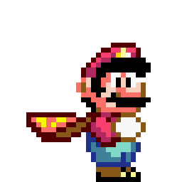
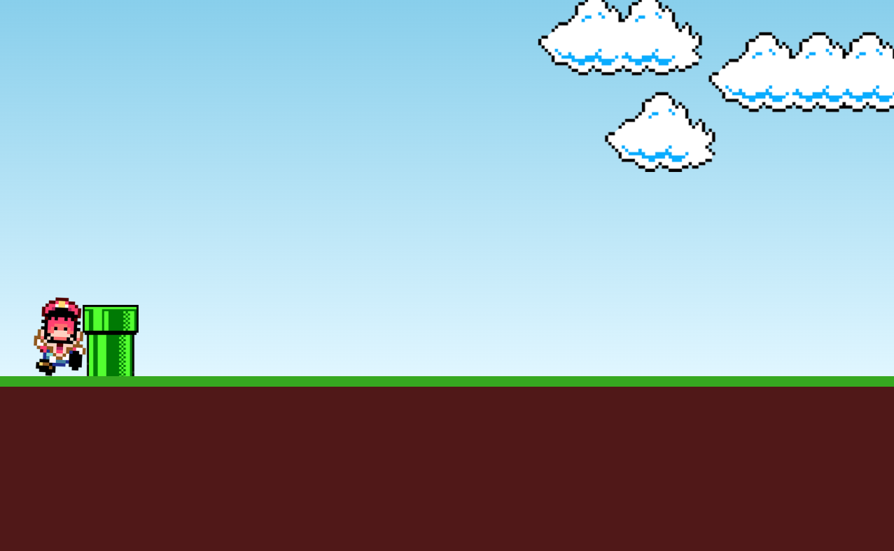

# 🍄 Mario Jump

<div align="center">



### 🎮 Um mini game inspirado no universo do Mario, desenvolvido com JavaScript puro


</div>

---

## 🚀 Demonstração

🔗 **Live Preview:** https://anaclarissi.github.io/mario-jump/

💻 **Repositório:** https://github.com/anaClarissi/mario-jump

---

## 📷 Preview

<div align="center">



</div>

---

## 🧠 Sobre o projeto

Este projeto é um mini game inspirado no clássico **Mario**, onde o jogador precisa desviar de obstáculos pulando no momento certo.

O jogo foi desenvolvido com foco em praticar **lógica de programação**, manipulação de DOM, animações com CSS e controle de eventos com JavaScript.

---

## ⚙️ Funcionalidades

* 🎮 Sistema de jogo interativo
* ⬆️ Pulo do personagem ao pressionar tecla
* 🚧 Obstáculos em movimento (cano)
* ☁️ Animação de cenário (nuvens)
* 💥 Detecção de colisão (Game Over)
* ▶️ Menu inicial com botão de play

---

## 🛠 Tecnologias utilizadas

<div align="center">

| Tecnologia | Descrição                |
| ---------- | ------------------------ |
| HTML5      | Estrutura do jogo        |
| CSS3       | Animações e layout       |
| JavaScript | Lógica do jogo           |
| DOM API    | Manipulação de elementos |

</div>

---

## 🎮 Como jogar

1. Clique em **Play**
2. Pressione qualquer tecla para fazer o Mario pular
3. Desvie dos canos
4. Tente sobreviver o máximo possível 😄

---

## 📂 Estrutura do projeto

```bash
mario-jump/
│
├── index.html
├── css/
│   └── style.css
├── js/
│   └── script.js
├── images/
│   ├── mario.gif
│   ├── pipe.png
│   ├── clouds.png
│   ├── game-over.png
│   └── preview.png
```

---

## 🧩 Como funciona

* O movimento do cano é feito com **CSS animations**
* O pulo do Mario é ativado via **evento de teclado**
* A colisão é detectada comparando:

  * posição do cano (`offsetLeft`)
  * posição do Mario (`bottom`)
* Quando há colisão:

  * o jogo para
  * animações são interrompidas
  * imagem de game over é exibida

---

## 📦 Como rodar o projeto

```bash
# Clone o repositório
git clone https://github.com/anaClarissi/mario-jump.git

# Acesse a pasta
cd mario-jump

# Abra o index.html no navegador
```

---

## 🎓 Créditos

Projeto desenvolvido com base no tutorial de:

* 📺 Manual do Dev
* 🔗 https://www.youtube.com/@ManualdoDev
* 💻 https://github.com/manualdodev

---

## 👩‍💻 Autora

Feito com 💙 por **Ana Clarissi**

🔗 LinkedIn: https://www.linkedin.com/in/anaclarissi

---

## 📌 Aprendizados

Durante este projeto, foram praticados:

* Manipulação de DOM
* Eventos de teclado
* Animações com CSS
* Lógica de colisão
* Controle de fluxo em tempo real
* Estruturação de mini games

---

## ✨ Melhorias futuras

* [ ] Adicionar pontuação 🏆
* [ ] Sistema de restart
* [ ] Sons do jogo 🔊
* [ ] Responsividade para mobile
* [ ] Aumentar dificuldade progressiva

---

## ⭐ Contribuição

Contribuições são bem-vindas!

1. Fork o projeto
2. Crie uma branch
3. Faça suas alterações
4. Envie um Pull Request

---

## 📄 Licença

Este projeto está sob a licença MIT.

---

<div align="center">

✨ Se gostou do projeto, deixe uma estrela! ✨

</div>
